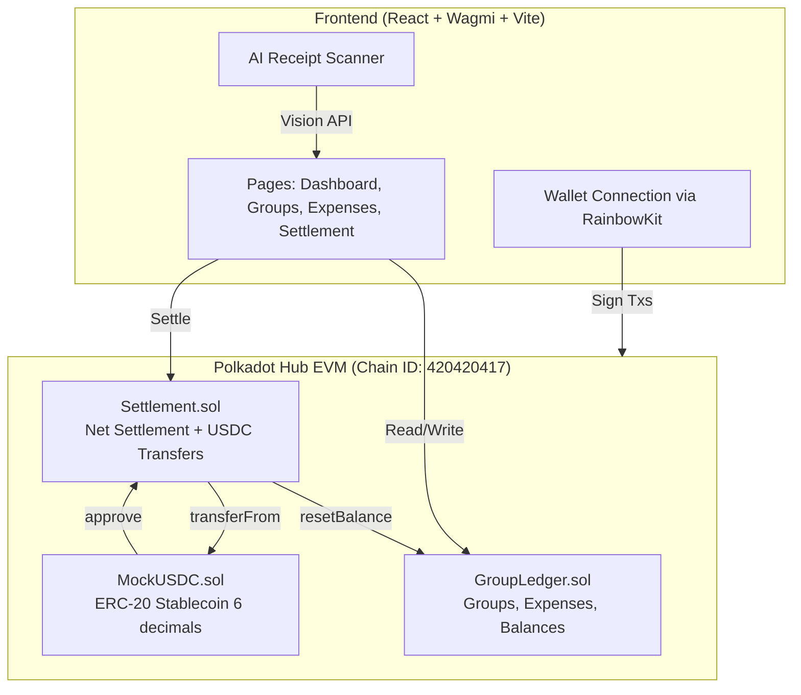

# SplitDot

On-chain group expense splitting with AI receipt scanning, built on Polkadot Hub EVM.

## Problem

Splitting expenses among friends is painful. Existing apps are centralized, balances are just numbers in a database, and settlement requires bank transfers or third-party payment apps. There's no transparency, no verifiability, and no programmable settlement.

## Solution

SplitDot brings group expense management on-chain with USDC stablecoin settlement on Polkadot Hub. An AI receipt scanner extracts amounts and line items from photos, making expense entry frictionless.

**Key features:**

- **On-chain ledger** -- Groups, expenses, and balances stored on Polkadot Hub EVM with full transparency
- **AI Receipt Scanner** -- Snap a photo, AI extracts amount, merchant, category, and line items
- **Net Settlement** -- Greedy algorithm minimizes the number of transfers needed to settle a group
- **USDC Settlement** -- One-click stablecoin settlement, no bank transfers needed
- **Equal or Custom Split** -- Split expenses equally or assign custom amounts per member

## Architecture



```
Frontend (React + Wagmi)
    |
    |--- AI Receipt Scanner (OpenAI Vision API)
    |
    v
Polkadot Hub EVM (Chain ID: 420420417)
    |
    |--- GroupLedger.sol   -- Groups, expenses, balance tracking
    |--- Settlement.sol    -- Net settlement algorithm + USDC transfers
    |--- MockUSDC.sol      -- Test ERC-20 stablecoin (6 decimals)
```

### Smart Contracts

| Contract | Address | Description |
|----------|---------|-------------|
| GroupLedger | `0xc1A1C0E28D5c4dD37888D0FB25e4ee65f84D9953` | Group creation, expense recording, balance tracking |
| Settlement | `0x6e0610a475677A01C044D346F9C84451816B8fE9` | Net settlement calculation and USDC transfer execution |
| MockUSDC | `0xd573F0803fc2349f243d13887dde2938a7374827` | Test USDC token with 6 decimals |

All contracts deployed on **Polkadot Hub Testnet**.

### Net Settlement Algorithm

The settlement contract implements a greedy matching algorithm that minimizes the number of USDC transfers:

1. Calculate each member's net balance (what they're owed minus what they owe)
2. Separate into creditors (positive balance) and debtors (negative balance)
3. Greedily match the largest debtor with the largest creditor
4. Repeat until all balances are zero

For a group of N people, this reduces worst-case O(N^2) transfers to at most N-1.

## Tech Stack

**Smart Contracts:**
- Solidity 0.8.28
- Hardhat + @parity/hardhat-polkadot
- OpenZeppelin Contracts v5

**Frontend:**
- React 19 + TypeScript
- Vite 7 + Tailwind CSS v4
- Wagmi v3 + viem (wallet connection & contract interaction)
- Lucide React (icons)

**AI:**
- OpenAI-compatible Vision API (gpt-4o-mini)
- Receipt image parsing with structured JSON extraction

## Getting Started

### Prerequisites

- Node.js >= 22
- MetaMask or any injected wallet
- PAS tokens for gas (get from [Polkadot Faucet](https://faucet.polkadot.io/?parachain=assethubpolkadot))

### Smart Contracts

```bash
# Install dependencies
npm install

# Compile contracts
npx hardhat compile

# Run tests
npx hardhat test

# Deploy to Polkadot Hub Testnet
cp .env.example .env
# Edit .env with your private key
npx hardhat run scripts/deploy.ts --network polkadotHub
```

### Frontend

```bash
cd frontend

# Install dependencies
npm install

# Configure AI scanner (optional)
cp .env.example .env
# Edit .env with your API key

# Start dev server
npm run dev

# Build for production
npm run build
```

Open http://localhost:5173 in your browser.

### Connect Wallet

1. Install MetaMask
2. Add Polkadot Hub Testnet:
   - RPC: `https://eth-rpc-testnet.polkadot.io`
   - Chain ID: `420420417`
   - Currency: PAS
3. Get test PAS from faucet
4. Click "Connect" in SplitDot

## User Flow

1. **Connect wallet** -- Click Connect, approve in MetaMask
2. **Create a group** -- Add member addresses, confirm on-chain
3. **Add expenses** -- Enter amount manually or scan a receipt with AI
4. **View balances** -- See who owes whom in real-time
5. **Settle up** -- One-click USDC settlement with optimized transfers

## Project Structure

```
contracts/
  GroupLedger.sol       # Group and expense management
  Settlement.sol        # Net settlement + USDC transfers
  MockUSDC.sol          # Test stablecoin
test/
  GroupLedger.test.ts   # Contract test suite
scripts/
  deploy.ts             # Deployment script
frontend/
  src/
    components/         # Shared UI components
    contracts/          # ABIs and addresses
    lib/                # Utilities, wagmi config, AI scanner, toast
    pages/              # 5 page components
    App.tsx             # Router
    main.tsx            # Entry point with providers
```

## Why Polkadot?

- **Sub-second finality** -- Polkadot Hub provides near-instant transaction confirmations, critical for settlement UX
- **Cross-chain messaging (XCM)** -- Future multi-chain settlement across parachains without bridges
- **Low gas fees** -- Polkadot Hub testnet transactions cost fractions of a cent vs Ethereum L1
- **Path to real USDC** -- Asset Hub parachain enables native stablecoin integration on mainnet
- **Shared security** -- Polkadot's relay chain secures all parachains, including Hub EVM

## Security

- **Access control**: `GroupLedger.resetBalance()` restricted to the authorized Settlement contract via `onlySettlement` modifier. Owner can set the Settlement contract address exactly once.
- **Overpayment protection**: `Settlement.settleWith()` validates that the payment amount does not exceed the sender's actual debt, preventing balance manipulation.
- **AI API key**: The AI receipt scanner uses a client-side API key for demo simplicity. In production, this would be proxied through a backend to prevent key exposure.

## Roadmap

### Completed (Hackathon)

- On-chain group ledger with expense tracking and balance management
- AI receipt scanner (photo to structured data via Vision API)
- Net settlement algorithm with USDC stablecoin transfers
- Polished responsive frontend with wrong-network detection
- 35 contract tests covering access control, overpayment protection, and settlement flows

### Next Steps

- Multi-chain settlement via XCM (Polkadot's cross-chain messaging)
- Real USDC/USDT integration on Polkadot Hub mainnet
- Group invitation links (share URL to join)
- Spending analytics dashboard (charts by category/member)
- Mobile PWA with camera-first expense flow
- ENS/Polkadot identity resolution for member display names

### Long-term Vision

- Become the Splitwise of Web3 -- transparent, verifiable, cross-chain expense management
- Polkadot ecosystem grant application for mainnet launch
- Integration with Polkadot Hub DeFi protocols for yield on idle group funds

## Live Demo

- **App**: https://splitdot.vercel.app
- **Explorer**: https://blockscout-testnet.polkadot.io

## License

MIT
